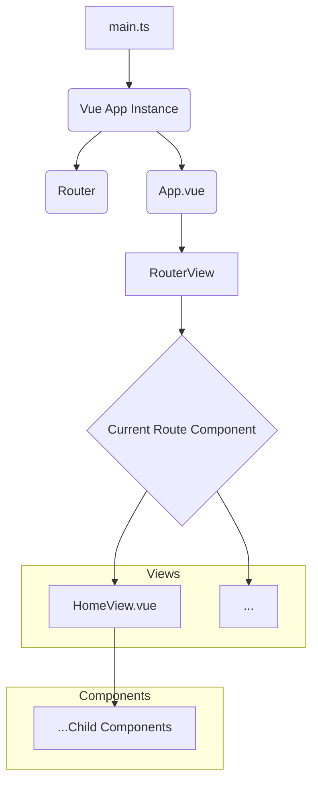

# System Patterns

## System Architecture

- **Frontend:** Vue.js single-page application (SPA).
- **Routing:** `vue-router` for managing navigation between views.
- **Structure:**
  - `main.ts`: Entry point, initializes Vue app and router.
  - `App.vue`: Root component, contains `<RouterView />`.
  - `views/`: Directory for page-level components.
  - `components/`: Directory for reusable UI components.
  - `router/index.ts`: Router configuration.
  - `assets/`: For static assets like CSS.
  - `stores/`: (Currently unused, but available for Pinia state management if needed).

## Key Technical Decisions

- **Framework:** Vue.js (selected by project initiation).
- **Language:** TypeScript (default with Vue CLI setup).
- **Build Tool:** Vite (default with Vue CLI setup).
- **Routing:** `vue-router` (standard for Vue SPAs).
- **Testing:**
  - Vitest for unit tests.
  - Playwright for E2E tests.
  - Storybook for component development and testing.
    (These are planned as per `.clinerules/02-basic-rules.md`)

## Design Patterns in Use

- **Component-Based Architecture:** Application built as a tree of reusable components.
- **Single File Components (SFCs):** `.vue` files encapsulating template, script, and style.

## Component Relationships

- `App.vue` is the root component.
- `RouterView` in `App.vue` renders the component associated with the current route.
- `HomeView.vue` is currently the only view, rendered for the `/` path.

## Critical Implementation Paths

- (To be defined as the project progresses, e.g., state management for todos, API integration if any.)
